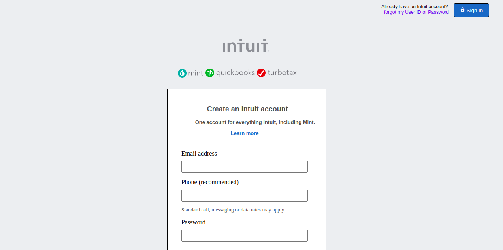

# mint-signup-page

> It is a sign up form prototype for Intuit website created for educational purposes.

## Built With

- HTML
- CSS
- Visual Studio Code

## Live Demo

[Live Demo Link](https://rawcdn.githack.com/Jarfsoft/mint-signup-page/23b2877cc86ce2ef592294f22117b68851221476/index.html)

## Getting Started

To get a local copy up and running follow these simple example steps.

Grab the index.html file and open it in any tab of your preferred internet browser.

## Authors

👤 Imran Yousaf

- GitHub: [@imran5644](https://github.com/imran5644)
- LinkedIn: [Imran Yousaf](https://www.linkedin.com/in/imran-yousaf-8777297b/)

👤 Juan Raudales

- GitHub: [@Jarfsoft](https://github.com/Jarfsoft)
- Twitter: [@Jarfsoft](https://twitter.com/Jarfsoft)
- LinkedIn: [Juan Raudales Flores](https://www.linkedin.com/in/juan-raudales-flores-7b0a3b113/)

## Show your support

Spread the word if you like this project.

## Acknowledgments

- Thanks to http://w3schools-fa.ir
- Thanks to https://stackoverflow.com
